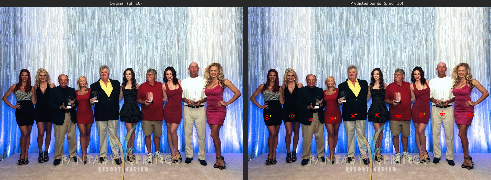

# MiniCPM-V 4.6 Fine-Tuning Tutorial

## 1 Model and Task Overview

This section uses the counting task [allenai/pixmo-count](https://huggingface.co/datasets/allenai/pixmo-count) as a fine-tuning example.

Training task:

- Input an image and a counting question
- Output the number of target objects in the image
- The target `assistant` response first lists the coordinates of each target object in `x y` format, for example, `<point>573 489</point>`, and then outputs the final count, such as `0`, `3`, or `10`.
- The evaluation metric is shown below:


| Metric | Meaning                                               |
| ------ | ----------------------------------------------------- |
| Acc@0  | Exact match accuracy (predicted value = ground truth) |


## 2 Fine-Tuning with ms-swift

### 2.1 Environment Setup

- **Minimum runnable installation steps**

```bash
conda create -n "MiniCPM-V-4.6-Counting" python=3.10 -y
conda activate "MiniCPM-V-4.6-Counting"

pip install torch==2.8.0 torchvision==0.23.0

pip install \
  transformers==5.7.0 accelerate==1.13.0 \
  deepspeed==0.18.3 peft==0.18.1 trl==0.24.0 \
  wandb ninja einops safetensors tokenizers sentencepiece

MAX_JOBS=32 NVCC_THREADS=4 pip install --no-build-isolation flash-attn==2.8.3
git clone https://github.com/modelscope/ms-swift.git
cd ms-swift
pip install -e .
```

- **Reference dependency versions**

```text
python                        3.10.0
accelerate                    1.13.0
deepspeed                     0.18.3
flash_attn                    2.8.3
ms_swift                      latest official code
torch                         2.8.0
torchvision                   0.23.0
transformers                  5.7.0
```

### 2.2 Data Preparation

Download the dataset from [allenai/pixmo-count](https://huggingface.co/datasets/allenai/pixmo-count) and convert it into the ms-swift format.

- **Data format reference:**
  ```json
  {
      "messages": [
          {
              "content": "<image>\nCarefully observe the image. Are there any people in the image? If yes, please list their respective coordinates and provide the total count. If no, answer 0.",
              "role": "user"
          },
          {
              "content": "<think>\n\n</think>\n\nThe respective coordinates of people: <point>236 469</point>, <point>307 232</point>, <point>362 434</point>, <point>485 521</point>, <point>487 340</point>, <point>615 386</point>, <point>735 441</point>, <point>870 615</point>. So the total count is 8.",
              "role": "assistant"
          }
      ],
      "images": [
          "/path/to/images/*.jpg"
      ],
      "source_file": "pixmo-count",
      "orig_index": 1,
      "channel": "pixmo-count"
  }
  ```
- For the Counting task, adding supervision on point prediction can improve fine-tuning performance. Therefore, we recommend concatenating the `points` coordinates from the dataset into the assistant response.
- Since MiniCPM-V 4.6 normalizes image coordinates to `0~1000`, the point coordinates also need to be transformed as follows:
  ```python
  def expected_norm(x_px: float, y_px: float, width: int, height: int) -> Tuple[int, int]:
      return int((x_px / width) * 1000.0), int((y_px / height) * 1000.0)
  ```
- For fine-tuning, we recommend adding `<think>\n\n</think>\n\n` to the assistant prefix, and using `--loss_scale ignore_empty_think` during training so that the empty think block is masked out in loss computation. For thinking tasks, use `<think>\n` instead.

### 2.3 Launch Training

After configuring the model path, training set path, validation set path, and output directory, run the following script to start training.

```bash
run_swift.sh
#!/bin/bash
set -euo pipefail

export CUDA_VISIBLE_DEVICES="${CUDA_VISIBLE_DEVICES:-0,1,2,3,4,5,6,7}"
export NPROC_PER_NODE="${NPROC_PER_NODE:-8}"
export MASTER_PORT="${MASTER_PORT:-29632}"

export WANDB_API_KEY="${WANDB_API_KEY:-}"
export WANDB_PROJECT="${WANDB_PROJECT:-MiniCPMV46-Counting}"
export WANDB_RUN_NAME="${WANDB_RUN_NAME:-mcpmv46_count}"
export WANDB_NAME="${WANDB_NAME:-mcpmv46_count}"

export DOWNSAMPLE_MODE="${DOWNSAMPLE_MODE:-4x}"

SWIFT_BIN="${SWIFT_BIN:-swift}"
MODEL_PATH="${MODEL_PATH:-/path/to/minicpm-v-4_6}"

TRAIN_DATA="${TRAIN_DATA:-/path/to/task_dataset/train/pixmo_count_train_with_channel}"
VALID_DATA="${VALID_DATA:-/path/to/task_dataset/val/validation-00000-of-00001-swift.parquet}"

DEEPSPEED_CONFIG="${DEEPSPEED_CONFIG:-zero2}"
SCRIPT_DIR="$(cd "$(dirname "${BASH_SOURCE[0]}")" && pwd)"
OUTPUT_DIR="${OUTPUT_DIR:-path/to/outdir}"

${SWIFT_BIN} sft \
  --model "${MODEL_PATH}" \
  --model_type minicpmv4_6 \
  --template minicpmv4_6 \
  --run_name "${WANDB_RUN_NAME}" \
  --dataset "${TRAIN_DATA}" \
  --val_dataset "${VALID_DATA}" \
  --deepspeed "${DEEPSPEED_CONFIG}" \
  --tuner_type full \
  --torch_dtype bfloat16 \
  --freeze_vit False \
  --packing false \
  --max_length 4096 \
  --num_train_epochs 4 \
  --per_device_train_batch_size 1 \
  --gradient_accumulation_steps 16 \
  --learning_rate 5e-6 \
  --warmup_ratio 0.05 \
  --logging_steps 1 \
  --save_steps 132 \
  --eval_strategy steps \
  --eval_steps 80 \
  --save_total_limit 30 \
  --load_from_cache_file false \
  --dataset_num_proc 16 \
  --dataloader_num_workers 16 \
  --enable_channel_loss True \
  --attn_impl flash_attn \
  --loss_scale ignore_empty_think \
  --output_dir "${OUTPUT_DIR}" \
  --report_to wandb
```

Key parameter notes

- Training supports two visual token compression ratios, `16x` and `4x`, which are controlled by `export DOWNSAMPLE_MODE="${DOWNSAMPLE_MODE:-4x}"`.
- The current version of `transformers` still has issues with packed training for the Qwen3.5 series. For now, please use `--packing false`. This document will be updated once an official fix is available.
- If prompt isolation was added during dataset construction, i.e. the assistant response starts with `<think>\n\n</think>\n\n`, this change should be paired with `--loss_scale ignore_empty_think` so that the prefix is masked out during loss computation.

### 2.4 Training Curves

[https://wandb.ai/majy24-tsinghua-university/MiniCPMV46-Counting/reports/ms-swift---VmlldzoxNjgxMDk0Ng](https://wandb.ai/majy24-tsinghua-university/MiniCPMV46-Counting/reports/ms-swift---VmlldzoxNjgxMDk0Ng)

### 2.5 Evaluation Results

The table below shows the evaluation results under two visual token compression ratios. Training and evaluation use the same settings, and both the best score among all checkpoints and the average score of the top three checkpoints are reported.


| Model            | Visual Token Compression Ratio | Acc@0 Top1 [1] | Acc@0 Avg.Top3 [2] |
| ---------------- | ------------------------------ | -------------- | ------------------ |
| MiniCPM-V 4.6    | 16                             | 46.5           | N/A [3]            |
| MiniCPM-V 4.6    | 4                              | 51.8           | N/A [3]            |
| Fine-tuned model | 16                             | 79.7           | 79.3               |
| Fine-tuned model | 4                              | 84.3           | 83.9               |


  [1]: The highest Acc@0 score among all checkpoints saved during training.

  [2]: The average Acc@0 score of the top three checkpoints saved during training.  
  [3]: MiniCPM-V 4.6 is the original model without fine-tuning, so only one Acc@0 result (Acc@0 Top1) is available.

- Output example:

```text
Q: Carefully observe the image. Are there any airplanes in the image? If yes, please list their respective coordinates and provide the total count. If no, answer 0.

A: The respective coordinates of airplanes: <point>310 370</point>, <point>365 277</point>, <point>388 486</point>, <point>405 185</point>, <point>437 368</point>, <point>474 611</point>, <point>503 250</point>, <point>527 451</point>, <point>535 818</point>, <point>597 331</point>. So the total count is 10.
```




## 3 Fine-Tuning with Llama-Factory

### 3.1 Environment Setup

- **Minimum runnable installation steps**

```bash
conda create -n "MiniCPM-V-4.6-Counting" python=3.11 -y
conda activate "MiniCPM-V-4.6-Counting"

pip install torch==2.8.0 torchvision==0.23.0

pip install \
  transformers==5.7.0 accelerate==1.13.0 \
  deepspeed==0.18.3 peft==0.18.1 trl==0.24.0 \
  wandb ninja einops safetensors tokenizers sentencepiece

MAX_JOBS=32 NVCC_THREADS=4 pip install --no-build-isolation flash-attn==2.8.3
git clone https://github.com/hiyouga/LlamaFactory.git
cd LlamaFactory
pip install -e .
pip install -r requirements/metrics.txt -r requirements/deepspeed.txt
```

- **Reference dependency versions**

```text
python                        3.11.0
accelerate                    1.13.0
deepspeed                     0.18.3
flash_attn                    2.8.3
llamafactory                  latest official code
torch                         2.8.0
torchvision                   0.23.0
transformers                  5.7.0
```

### 3.2 Data Preparation

- The preparation procedure is the same as in Section 2.2
- Note: when training with LlamaFactory, you also need to provide the corresponding `dataset_info.json`

### 3.3 Launch Training

- Configure `train.yaml`

```yaml
### model
model_name_or_path: /path/to/minicpm-v-4_6
trust_remote_code: true
flash_attn: fa2

### method
stage: sft
do_train: true
finetuning_type: full
freeze_vision_tower: false
deepspeed: LlamaFactory/examples/deepspeed/ds_z2_config.json

### dataset
dataset: pixmo_count_train
eval_dataset: pixmo_count_val
dataset_dir: /path/to/dataset_dir # dataset_dir should contain dataset_info.json file
template: minicpm_v_4_6
cutoff_len: 4096
preprocessing_num_workers: 16
dataloader_num_workers: 16
overwrite_cache: true

### output
output_dir: /path/to/output_dir
logging_steps: 1
save_steps: 132
save_total_limit: 30
eval_strategy: steps
eval_steps: 80
plot_loss: true
overwrite_output_dir: false
report_to: wandb

### train
per_device_train_batch_size: 1
per_device_eval_batch_size: 1
gradient_accumulation_steps: 16
learning_rate: 5.0e-6
num_train_epochs: 4.0
lr_scheduler_type: cosine
warmup_ratio: 0.05
bf16: true
max_grad_norm: 1000
ddp_timeout: 180000000
weight_decay: 0.1
adam_beta2: 0.95
```

- Run `run.sh`

```bash
#!/bin/bash
set -euo pipefail

export CUDA_VISIBLE_DEVICES="${CUDA_VISIBLE_DEVICES:-0,1,2,3,4,5,6,7}"
export NPROC_PER_NODE="${NPROC_PER_NODE:-8}"
export MASTER_PORT="${MASTER_PORT:-29632}"

export WANDB_API_KEY="${WANDB_API_KEY:-}"
export WANDB_PROJECT="${WANDB_PROJECT:-MiniCPMV46-Counting}"
export WANDB_RUN_NAME="${WANDB_RUN_NAME:-mcpmv46_count}"
export WANDB_NAME="${WANDB_NAME:-mcpmv46_count}"

# MiniCPMV 4.6 downsample mode: 4x for high-resolution, 16x for default
export DOWNSAMPLE_MODE="${DOWNSAMPLE_MODE:-4x}"

export DISABLE_VERSION_CHECK=1
# Activate the lfv46 conda environment

# IMPORTANT: Unset USE_V1 to use the v2 launcher
unset USE_V1

CONFIG_FILE="$(dirname "$0")/train.yaml"
OUTPUT_DIR="${OUTPUT_DIR:-/path/to/output_dir}"

echo "Training with config: $CONFIG_FILE"
echo "Output dir: $OUTPUT_DIR"

llamafactory-cli train "$CONFIG_FILE"
```

### 3.4 Training Curves

[https://wandb.ai/majy24-tsinghua-university/MiniCPMV46-Counting-LF/reports/Llama-Factory---VmlldzoxNjgyNzk4NQ](https://wandb.ai/majy24-tsinghua-university/MiniCPMV46-Counting-LF/reports/Llama-Factory---VmlldzoxNjgyNzk4NQ)

### 3.5 Evaluation Results

The table below shows the evaluation results under two visual token compression ratios. Training and evaluation use the same settings, and both the best score among all checkpoints and the average score of the top three checkpoints are reported.


| Model            | Visual Token Compression Ratio | Acc@0 Top1 [1] | Acc@0 Avg.Top3 [2] |
| ---------------- | ------------------------------ | -------------- | ------------------ |
| MiniCPM-V 4.6    | 16                             | 46.5           | N/A [3]            |
| MiniCPM-V 4.6    | 4                              | 51.8           | N/A [3]            |
| Fine-tuned model | 16                             | 78.4           | 78.1               |
| Fine-tuned model | 4                              | 83.1           | 82.5               |


  [1]: The highest Acc@0 score among all checkpoints saved during training.

  [2]: The average Acc@0 score of the top three checkpoints saved during training.  
  [3]: MiniCPM-V 4.6 is the original model without fine-tuning, so only one Acc@0 result (Acc@0 Top1) is available and Acc@0 Avg.Top3 cannot be computed.

- Output example:

```text
Q: Carefully observe the image. Are there any airplanes in the image? If yes, please list their respective coordinates and provide the total count. If no, answer 0.

A: The respective coordinates of airplanes: <point>310 370</point>, <point>360 275</point>, <point>385 486</point>, <point>402 180</point>, <point>439 368</point>, <point>474 611</point>, <point>505 250</point>, <point>532 448</point>, <point>536 818</point>, <point>597 328</point>. So the total count is 10.
```


