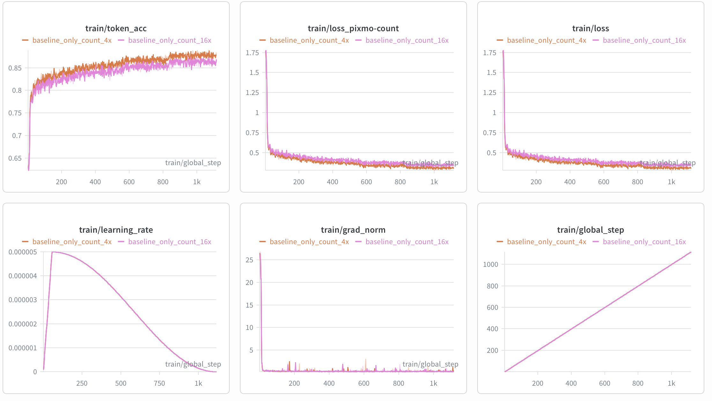

# MiniCPM-V 4.6 微调教程

## 1 模型与任务概览

本章节以 [Counting](https://huggingface.co/datasets/allenai/pixmo-count) 任务作为微调示例。

训练任务：

- 输入一张图片和一个计数问题
- 输出图片中目标物体的数量
- `assistant` 目标输出需要先给出每个目标物体点的位置，用 `x y` 坐标表示，如 `<point>573 489</point>`，再输出最终数量，例如 `0`、`3`、`10`。
- 评测指标如下：


| 指标    | 含义               |
| ----- | ---------------- |
| Acc@0 | 精确匹配率（预测值 = 真实值） |


## 2 使用 ms-swift 微调

### 2.1 环境说明

- **最小可运行安装步骤**

```bash
conda create -n "MiniCPM-v_4.6-VL" python=3.10 -y
conda activate "MiniCPM-v_4.6-VL"

pip install torch==2.8.0 torchvision==0.23.0

pip install \
  transformers==5.7.0 accelerate==1.13.0 \
  deepspeed==0.18.3 peft==0.18.1 trl==0.24.0 \
  wandb ninja einops safetensors tokenizers sentencepiece

MAX_JOBS=32 NVCC_THREADS=4 pip install --no-build-isolation flash-attn==2.8.3
git clone https://github.com/modelscope/ms-swift.git
cd ms-swift
pip install -e .
```

- **依赖版本参考**

```text
python                        3.10.0
accelerate                    1.13.0
deepspeed                     0.18.3
flash_attn                    2.8.3
ms_swift                      官方最新代码
torch                         2.8.0
torchvision                   0.23.0
transformers                  5.7.0
```

### 2.2 数据准备

- **数据下载**：数据来源为 [allenai/pixmo-count](https://huggingface.co/datasets/allenai/pixmo-count)，先从 Hugging Face 下载相关文件

```text
hf download allenai/pixmo-count --repo-type dataset --local-dir path_to_your_hf_file
```

- **图片下载**：根据 parquet 文件中的 `image_url` 列下载图片
- **数据集构建**：需要将数据集转换为 ms-swift 格式
  - 如果要支持带 points 训练，需要将 parquet 文件中 points 一列中的点坐标拼到 assistant 消息中。
  - 由于 MiniCPM-V 4.6 会将图片坐标归一化到 `0~1000`，因此也需要对 points 坐标进行以下处理：
    ```python
    def expected_norm(x_px: float, y_px: float, width: int, height: int) -> Tuple[int, int]:
        return int((x_px / width) * 1000.0), int((y_px / height) * 1000.0)
    ```
  - 如果要追求进一步的训练稳定，可以使用提示词隔离的技巧，在 assistant 前缀中加入 `<think>\n\n</think>\n\n`，并且在训练时使用 `--loss_scale ignore_empty_think` 参数保证空 think 在计算 loss 时被 mask 掉。
  - **数据格式参考：**
    ```json
    {
        "messages": [
            {
                "content": "<image>\nCarefully observe the image. Are there any people in the image? If yes, please list their respective coordinates and provide the total count. If no, answer 0.",
                "role": "user"
            },
            {
                "content": "<think>\n\n</think>\n\nThe respective coordinates of people: <point>236 469</point>, <point>307 232</point>, <point>362 434</point>, <point>485 521</point>, <point>487 340</point>, <point>615 386</point>, <point>735 441</point>, <point>870 615</point>. So the total count is 8.",
                "role": "assistant"
            }
        ],
        "images": [
            "/path/to/images/*.jpg"
        ],
        "source_file": "pixmo-count",
        "orig_index": 1,
        "channel": "pixmo-count"
    }
    ```

### 2.3 启动训练

- **最小可运行方式**：配置好模型路径、训练集路径、验证集路径和输出目录后，执行以下脚本。

```bash
run_swift.sh
#!/bin/bash
set -euo pipefail

export CUDA_VISIBLE_DEVICES="${CUDA_VISIBLE_DEVICES:-0,1,2,3,4,5,6,7}"
export NPROC_PER_NODE="${NPROC_PER_NODE:-8}"
export MASTER_PORT="${MASTER_PORT:-29632}"

export WANDB_API_KEY="${WANDB_API_KEY:-}"
export WANDB_PROJECT="${WANDB_PROJECT:-MiniCPMV46-Counting}"
export WANDB_RUN_NAME="${WANDB_RUN_NAME:-mcpmv46_count}"
export WANDB_NAME="${WANDB_NAME:-mcpmv46_count}"

export DOWNSAMPLE_MODE="${DOWNSAMPLE_MODE:-4x}"

SWIFT_BIN="${SWIFT_BIN:-swift}"
MODEL_PATH="${MODEL_PATH:-/path/to/minicpm-v-4_6}"

TRAIN_DATA="${TRAIN_DATA:-/path/to/task_dataset/train/pixmo_count_train_with_channel}"
VALID_DATA="${VALID_DATA:-/path/to/task_dataset/val/validation-00000-of-00001-swift.parquet}"

DEEPSPEED_CONFIG="${DEEPSPEED_CONFIG:-zero2}"
SCRIPT_DIR="$(cd "$(dirname "${BASH_SOURCE[0]}")" && pwd)"
OUTPUT_DIR="${OUTPUT_DIR:-path/to/outdir}"

${SWIFT_BIN} sft \
  --model "${MODEL_PATH}" \
  --model_type minicpmv4_6 \
  --template minicpmv4_6 \
  --run_name "${WANDB_RUN_NAME}" \
  --dataset "${TRAIN_DATA}" \
  --val_dataset "${VALID_DATA}" \
  --deepspeed "${DEEPSPEED_CONFIG}" \
  --tuner_type full \
  --torch_dtype bfloat16 \
  --freeze_vit False \
  --packing false \
  --max_length 4096 \
  --num_train_epochs 4 \
  --per_device_train_batch_size 1 \
  --gradient_accumulation_steps 16 \
  --learning_rate 5e-6 \
  --warmup_ratio 0.05 \
  --logging_steps 1 \
  --save_steps 132 \
  --eval_strategy steps \
  --eval_steps 80 \
  --save_total_limit 30 \
  --load_from_cache_file false \
  --dataset_num_proc 16 \
  --dataloader_num_workers 16 \
  --enable_channel_loss True \
  --attn_impl flash_attn \
  --loss_scale ignore_empty_think \
  --output_dir "${OUTPUT_DIR}" \
  --report_to wandb
```

- **关键参数说明**
  - 训练支持 `16x`、`4x` 两种下采样率，通过 `export DOWNSAMPLE_MODE="${DOWNSAMPLE_MODE:-4x}"` 一行进行控制。
  - 当前版本的 `transformers` 对 Qwen3.5 系列的 packing 支持并不好，为了防止过拟合，请使用 `--packing false`。
  - 如果先前的数据集构建过程中进行了提示词隔离，即在 assistant 回复加入 `<think>\n\n</think>\n\n` 前缀，这样的改动需要结合 `--loss_scale ignore_empty_think` 来确保前缀在计算 loss 时被 mask 掉。

### 2.4 训练过程

[https://wandb.ai/majy24-tsinghua-university/MiniCPMV46-Counting/reports/ms-swift---VmlldzoxNjgxMDk0Ng](https://wandb.ai/majy24-tsinghua-university/MiniCPMV46-Counting/reports/ms-swift---VmlldzoxNjgxMDk0Ng)




### 2.5 评测结果

- 下表展示了两种视觉 Token 压缩率设置下的评测结果。训练与评测参数保持一致，并同时给出了所有 checkpoint 中的最高分数和前三名平均分数。


| 模型               | 视觉 Token 压缩率 | Acc@0 Top1 | Acc@0 Avg.Top3 |
| ---------------- | ------------ | ---------- | -------------- |
| MiniCPM-V 4.6    | 16           | 46.5       | N/A            |
| MiniCPM-V 4.6    | 4            | 51.8       | N/A            |
| Fine-tuned model | 16           | 79.7       | 79.3           |
| Fine-tuned model | 4            | 84.3       | 83.9           |


- 输出样例：

```text
The respective coordinates of people: 82 638, 175 638, 264 648, 347 652, 439 629, 537 626, 620 632, 708 628, 796 616, 915 632. So the total count is 10.
```

## 3 使用 Llama-Factory 微调

### 3.1 环境说明

- **最小可运行安装步骤**

```bash
conda create -n "MiniCPM-v_4.6-VL" python=3.11 -y
conda activate "MiniCPM-v_4.6-VL"

pip install torch==2.8.0 torchvision==0.23.0

pip install \
  transformers==5.7.0 accelerate==1.13.0 \
  deepspeed==0.18.3 peft==0.18.1 trl==0.24.0 \
  wandb ninja einops safetensors tokenizers sentencepiece

MAX_JOBS=32 NVCC_THREADS=4 pip install --no-build-isolation flash-attn==2.8.3
git clone https://github.com/hiyouga/LlamaFactory.git
cd LlamaFactory
pip install -e .
pip install -r requirements/metrics.txt -r requirements/deepspeed.txt
```

- **依赖版本参考**

```text
python                        3.11.0
accelerate                    1.13.0
deepspeed                     0.18.3
flash_attn                    2.8.3
llamafactory                  官方最新代码
torch                         2.8.0
torchvision                   0.23.0
transformers                  5.7.0
```

### 3.2 数据准备

- 准备方式与 2.2 相同
- 注意：使用 LlamaFactory 训练时，还需要提供数据集对应的 `dataset_info.json`

### 3.3 启动训练

- **最小可运行方式**：准备好 `train.yaml` 后，执行下面脚本即可开始训练。
- 1. 配置 `train.yaml`

```yaml
### model
model_name_or_path: /path/to/minicpm-v-4_6
trust_remote_code: true
flash_attn: fa2

### method
stage: sft
do_train: true
finetuning_type: full
freeze_vision_tower: false
deepspeed: LlamaFactory/examples/deepspeed/ds_z2_config.json

### dataset
dataset: pixmo_count_train
eval_dataset: pixmo_count_val
dataset_dir: /path/to/dataset_dir # dataset_dir should contain dataset_info.json file
template: minicpm_v_4_6
cutoff_len: 4096
preprocessing_num_workers: 16
dataloader_num_workers: 16
overwrite_cache: true

### output
output_dir: /path/to/output_dir
logging_steps: 1
save_steps: 132
save_total_limit: 30
eval_strategy: steps
eval_steps: 80
plot_loss: true
overwrite_output_dir: false
report_to: wandb

### train
per_device_train_batch_size: 1
per_device_eval_batch_size: 1
gradient_accumulation_steps: 16
learning_rate: 5.0e-6
num_train_epochs: 4.0
lr_scheduler_type: cosine
warmup_ratio: 0.05
bf16: true
max_grad_norm: 1000
ddp_timeout: 180000000
weight_decay: 0.1
adam_beta2: 0.95
```

- 2. 执行 `run.sh`

```bash
#!/bin/bash
set -euo pipefail

export CUDA_VISIBLE_DEVICES="${CUDA_VISIBLE_DEVICES:-0,1,2,3,4,5,6,7}"
export NPROC_PER_NODE="${NPROC_PER_NODE:-8}"
export MASTER_PORT="${MASTER_PORT:-29632}"

export WANDB_API_KEY="${WANDB_API_KEY:-}"
export WANDB_PROJECT="${WANDB_PROJECT:-MiniCPMV46-Counting}"
export WANDB_RUN_NAME="${WANDB_RUN_NAME:-mcpmv46_count}"
export WANDB_NAME="${WANDB_NAME:-mcpmv46_count}"

# MiniCPMV 4.6 downsample mode: 4x for high-resolution, 16x for default
export DOWNSAMPLE_MODE="${DOWNSAMPLE_MODE:-4x}"

export DISABLE_VERSION_CHECK=1
# Activate the lfv46 conda environment

# IMPORTANT: Unset USE_V1 to use the v2 launcher
unset USE_V1

CONFIG_FILE="$(dirname "$0")/train.yaml"
OUTPUT_DIR="${OUTPUT_DIR:-/path/to/output_dir}"

echo "Training with config: $CONFIG_FILE"
echo "Output dir: $OUTPUT_DIR"

llamafactory-cli train "$CONFIG_FILE"
```

### 3.4 训练过程

[https://wandb.ai/majy24-tsinghua-university/MiniCPMV46-Counting-LF/reports/Llama-Factory---VmlldzoxNjgyNzk4NQ](https://wandb.ai/majy24-tsinghua-university/MiniCPMV46-Counting-LF/reports/Llama-Factory---VmlldzoxNjgyNzk4NQ)


### 3.5 评测结果

- 下表展示了两种视觉 Token 压缩率设置下的评测结果。训练与评测参数保持一致，并同时给出了所有 checkpoint 中的最高分数和前三名平均分数。


| 模型               | 视觉 Token 压缩率 | Acc@0 Top1 | Acc@0 Avg.Top3 |
| ---------------- | ------------ | ---------- | -------------- |
| MiniCPM-V 4.6    | 16           | 46.5       | N/A            |
| MiniCPM-V 4.6    | 4            | 51.8       | N/A            |
| Fine-tuned model | 16           | 78.4       | 78.1           |
| Fine-tuned model | 4            | 83.1       | 82.5           |


- 输出样例：

```text
The respective coordinates of airplanes: 131 802, 208 602, 275 442, 337 277, 358 699, 428 523, 497 333, 587 602, 667 375, 865 393. So the total count is 10.
```

