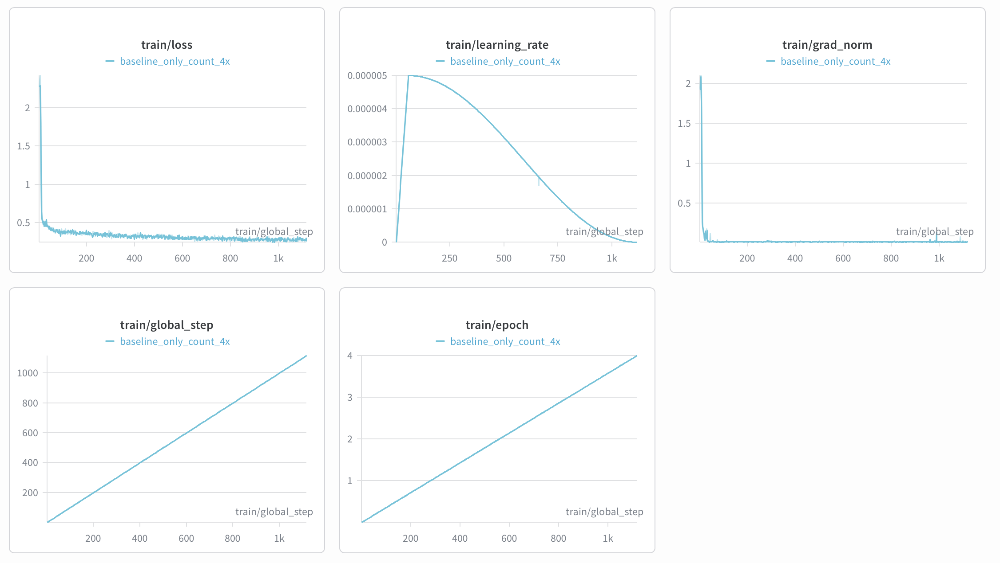
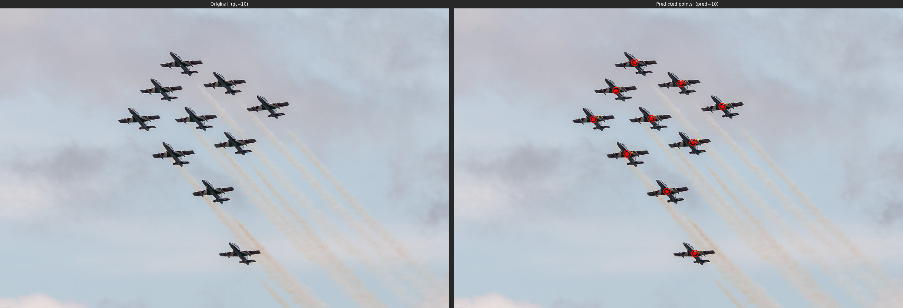

# MiniCPM-V 4.6 微调教程 (LlaMA-Factory)

## 1 模型与任务概览

本章节以 counting 任务 [allenai/pixmo-count](https://huggingface.co/datasets/allenai/pixmo-count) 作为微调示例。

训练任务：

- 输入一张图片和一个计数问题
- `assistant` 目标输出需要先给出每个目标物体点的位置，用 `x y` 坐标表示，如 `<point>573 489</point>`，再输出最终数量，例如 `0`、`3`、`10`。


## 2 使用 LlaMA-Factory 微调

### 2.1 环境说明

- **最小可运行安装步骤**

```bash
conda create -n "MiniCPM-V-4.6-Counting" python=3.11 -y
conda activate "MiniCPM-V-4.6-Counting"

pip install torch==2.8.0 torchvision==0.23.0

pip install \
  transformers==5.7.0 accelerate==1.13.0 \
  deepspeed==0.18.3 peft==0.18.1 trl==0.24.0 \
  wandb ninja einops safetensors tokenizers sentencepiece

MAX_JOBS=32 NVCC_THREADS=4 pip install --no-build-isolation flash-attn==2.8.3
git clone https://github.com/hiyouga/LlamaFactory.git
cd LlamaFactory
pip install -e .
pip install -r requirements/metrics.txt -r requirements/deepspeed.txt
```

- **依赖版本参考**

```text
python                        3.11.0
accelerate                    1.13.0
deepspeed                     0.18.3
flash_attn                    2.8.3
llamafactory                  官方最新代码
torch                         2.8.0
torchvision                   0.23.0
transformers                  5.7.0
```

### 2.2 数据准备

从 [allenai/pixmo-count](https://huggingface.co/datasets/allenai/pixmo-count) 下载数据集，并将其转换为 json 格式。
  - **数据格式参考：**
    ```json
    {
        "messages": [
            {
                "content": "<image>\nCarefully observe the image. Are there any people in the image? If yes, please list their respective coordinates and provide the total count. If no, answer 0.",
                "role": "user"
            },
            {
                "content": "<think>\n\n</think>\n\nThe respective coordinates of people: <point>236 469</point>, <point>307 232</point>, <point>362 434</point>, <point>485 521</point>, <point>487 340</point>, <point>615 386</point>, <point>735 441</point>, <point>870 615</point>. So the total count is 8.",
                "role": "assistant"
            }
        ],
        "images": [
            "/path/to/images/*.jpg"
        ],
        "source_file": "pixmo-count",
        "orig_index": 1,
        "channel": "pixmo-count"
    }
  - Counting 任务中加入对 points 预测的监督能够提高微调的效果，因此我们推荐将数据中的 points 坐标拼到 assistant 回复中。
  - 由于 MiniCPM-V 4.6 会将图片坐标归一化到 `0~1000`，因此也需要对 points 坐标进行以下处理：
    ```python
    def expected_norm(x_px: float, y_px: float, width: int, height: int) -> Tuple[int, int]:
        return int((x_px / width) * 1000.0), int((y_px / height) * 1000.0)
    ```
  - 微调训练推荐在 assistant 前缀中加入 `<think>\n\n</think>\n\n`。（如果是 thinking 的任务，则加入 `<think>\n`）    

### 2.3 启动训练

配置好模型路径、训练集路径、验证集路径和输出目录后，执行以下脚本即可以开始训练。
- 配置 `train.yaml`

```yaml
### model
model_name_or_path: /path/to/minicpm-v-4_6
trust_remote_code: true
flash_attn: fa2

### method
stage: sft
do_train: true
finetuning_type: full
freeze_vision_tower: false
deepspeed: LlamaFactory/examples/deepspeed/ds_z2_config.json

### dataset
dataset: pixmo_count_train
eval_dataset: pixmo_count_val
dataset_dir: /path/to/dataset_dir # dataset_dir should contain dataset_info.json file
template: minicpm_v_4_6
cutoff_len: 4096
preprocessing_num_workers: 16
dataloader_num_workers: 16
overwrite_cache: true

### output
output_dir: /path/to/output_dir
logging_steps: 1
save_steps: 132
save_total_limit: 30
eval_strategy: steps
eval_steps: 80
plot_loss: true
overwrite_output_dir: false
report_to: wandb

### train
per_device_train_batch_size: 1
per_device_eval_batch_size: 1
gradient_accumulation_steps: 16
learning_rate: 5.0e-6
num_train_epochs: 4.0
lr_scheduler_type: cosine
warmup_ratio: 0.05
bf16: true
max_grad_norm: 1000
ddp_timeout: 180000000
weight_decay: 0.1
adam_beta2: 0.95
```

- 执行 `run.sh`

```bash
#!/bin/bash
set -euo pipefail

export CUDA_VISIBLE_DEVICES="${CUDA_VISIBLE_DEVICES:-0,1,2,3,4,5,6,7}"
export NPROC_PER_NODE="${NPROC_PER_NODE:-8}"
export MASTER_PORT="${MASTER_PORT:-29632}"

export WANDB_API_KEY="${WANDB_API_KEY:-}"
export WANDB_PROJECT="${WANDB_PROJECT:-MiniCPMV46-Counting}"
export WANDB_RUN_NAME="${WANDB_RUN_NAME:-mcpmv46_count}"
export WANDB_NAME="${WANDB_NAME:-mcpmv46_count}"

# MiniCPMV 4.6 downsample mode: 4x for high-resolution, 16x for default
export DOWNSAMPLE_MODE="${DOWNSAMPLE_MODE:-4x}"

export DISABLE_VERSION_CHECK=1
# Activate the lfv46 conda environment

# IMPORTANT: Unset USE_V1 to use the v2 launcher
unset USE_V1

CONFIG_FILE="$(dirname "$0")/train.yaml"
OUTPUT_DIR="${OUTPUT_DIR:-/path/to/output_dir}"

echo "Training with config: $CONFIG_FILE"
echo "Output dir: $OUTPUT_DIR"

llamafactory-cli train "$CONFIG_FILE"
```

关键参数说明
- 训练支持 `16x`、`4x` 两种视觉 Token 压缩率，通过 `export DOWNSAMPLE_MODE="${DOWNSAMPLE_MODE:-4x}"` 参数进行控制。
- 当前版本的 `transformers` 对 Qwen3.5 系列的 packing 训练的支持仍存在问题，目前请先不要使用 packing 模式，官方修复后本文档也会进行更新。

### 2.4 训练过程

[https://wandb.ai/majy24-tsinghua-university/MiniCPMV46-Counting-LF/reports/Llama-Factory---VmlldzoxNjgyNzk4NQ](https://wandb.ai/majy24-tsinghua-university/MiniCPMV46-Counting-LF/reports/Llama-Factory---VmlldzoxNjgyNzk4NQ)




### 2.5 评测结果

- 评测指标说明：

| 指标 | 说明 |
| --- | --- |
| Acc@0 | 精确匹配率，即预测值与真实值完全一致 |
| Acc@0 Top1 | 训练过程保存的所有 checkpoint 中，评测结果 Acc@0 的最高分数 |
| Acc@0 Avg.Top3 | 训练过程保存的所有 checkpoint 中，评测结果 Acc@0 前三名的平均分数 |

- 下表展示了两种视觉 Token 压缩率设置下的评测结果：

| 模型               | 视觉 Token 压缩率 | Acc@0 Top1 | Acc@0 Avg.Top3 |
| ---------------- | ------------ | ---------- | -------------- |
| MiniCPM-V 4.6    | 16           | 46.5       | N/A  [1]          |
| MiniCPM-V 4.6    | 4            | 51.8       | N/A  [1]          |
| Fine-tuned model | 16           | 78.4       | 78.1           |
| Fine-tuned model | 4            | 83.1       | 82.5           |

<small>[1]: MiniCPM-V 4.6 为原始模型，未经微调，仅有一个 Acc@0 结果 (Acc@0 Top1)，无法计算 Acc@0 Avg.Top3</small>

- 输出样例：

  ```text
  Q: Carefully observe the image. Are there any airplanes in the image? If yes, please list their respective coordinates and provide the total count. If no, answer 0.

  A: The respective coordinates of airplanes: <point>310 370</point>, <point>360 275</point>, <point>385 486</point>, <point>402 180</point>, <point>439 368</point>, <point>474 611</point>, <point>505 250</point>, <point>532 448</point>, <point>536 818</point>, <point>597 328</point>. So the total count is 10.
  ```

  
